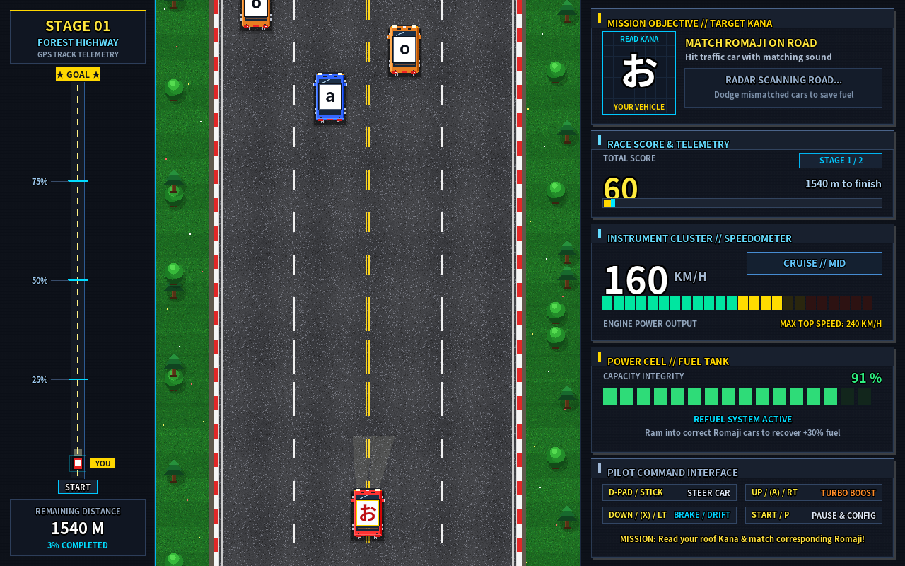
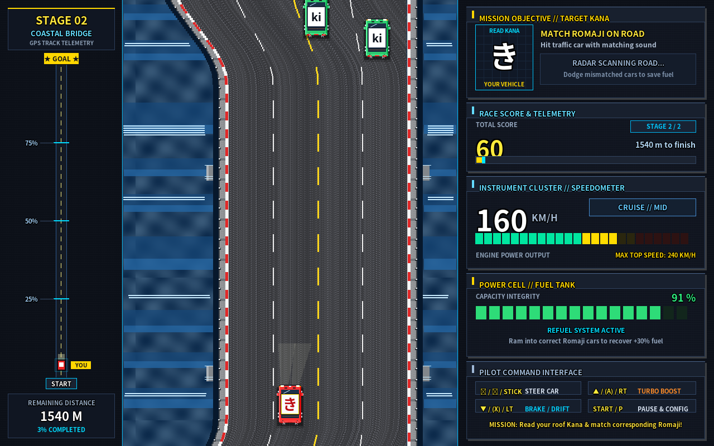
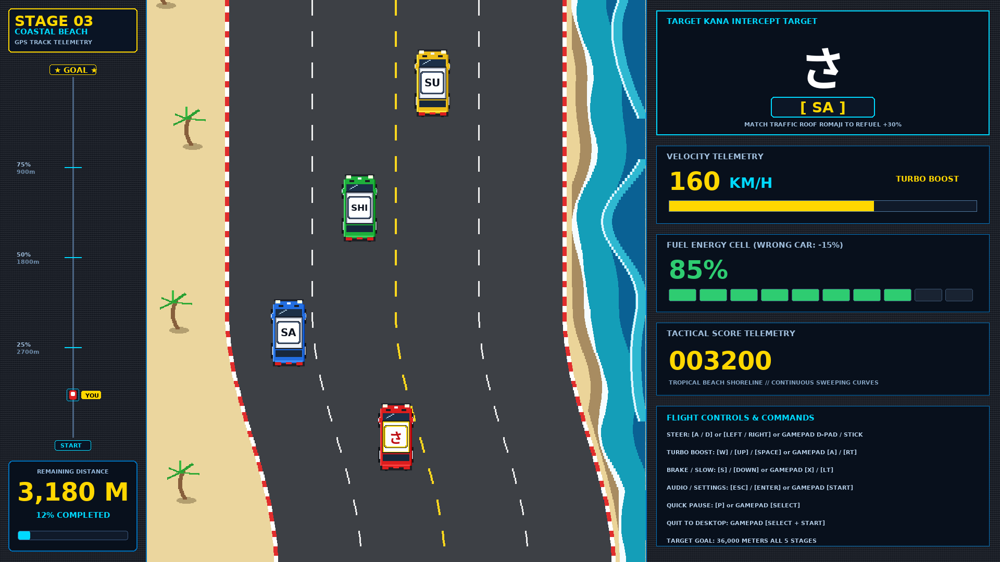
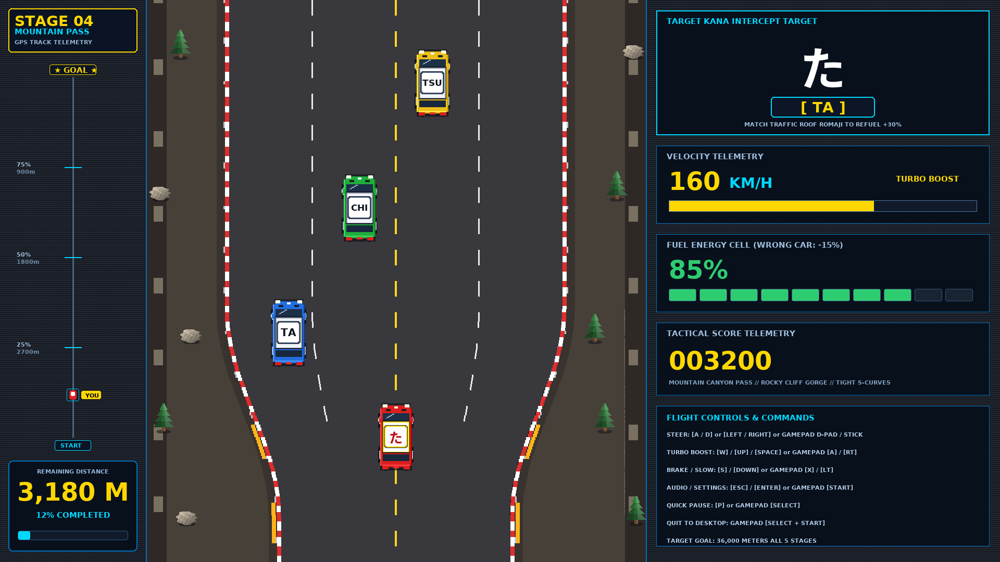
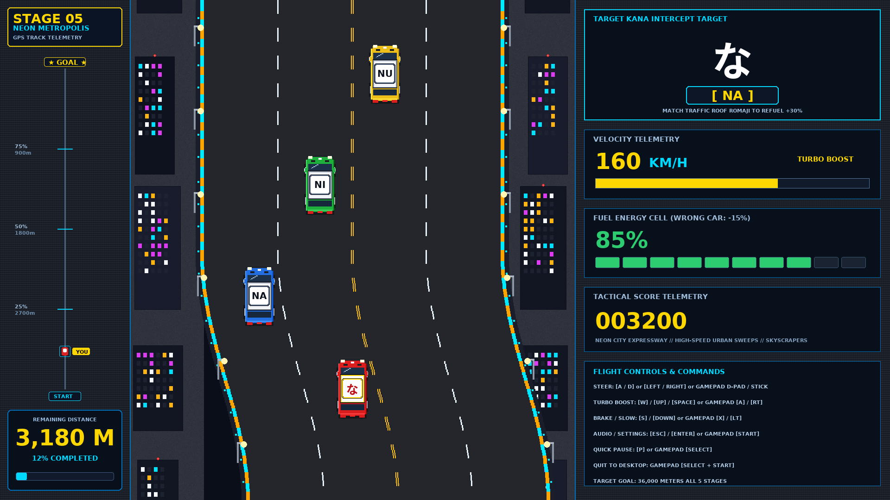
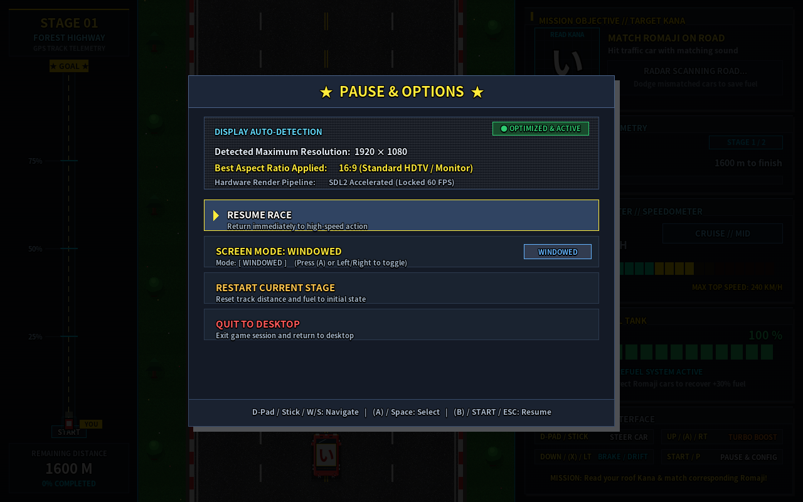

# Hiragana Road Fighter (ひらがな ロードファイター)

[](https://www.python.org/)
[](https://www.pygame.org/)
[-orange.svg)](https://store.steampowered.com/steamdeck)
[-brightgreen.svg)](#5-stages--hiragana-syllabus)
[](LICENSE)

A retro Japanese Hiragana learning arcade racer built in Python (Pygame), inspired by Konami's arcade classic *Road Fighter*. Players master reading and recognizing Hiragana characters at adrenaline-pumping speeds of up to 240 KM/H!

---

## ⚡ Direct Download (Standalone AppImage)

You do **not** need to install Python, dependencies, or compile code. You can download and launch the standalone Linux AppImage directly:

### 🚀 One-Line Terminal Shortcut (Download & Run)

Paste this single command into your terminal (Steam Deck Konsole, Arch, Ubuntu, Fedora) to download and launch immediately:

```bash
curl -sSL https://raw.githubusercontent.com/deck-labs/hiragana-road-fighter/main/download.sh | bash
```

Or download manually:

```bash
curl -LO https://github.com/deck-labs/hiragana-road-fighter/releases/latest/download/Hiragana_Road_Fighter-x86_64.AppImage
chmod +x Hiragana_Road_Fighter-x86_64.AppImage
./Hiragana_Road_Fighter-x86_64.AppImage
```

---

## 📸 Screenshots

| Stage 1: Forest Highway (あいうえお) | Stage 2: Coastal Bridge (かきくけこ) |
| :---: | :---: |
|  |  |

| Stage 3: Coastal Beach (さしすせそ) | Stage 4: Mountain Pass (たちつてと) |
| :---: | :---: |
|  |  |

| Stage 5: Neon Metropolis (なにぬねの) | Authentic Freeze-Frame Pause |
| :---: | :---: |
|  |  |

---

## 🏎️ 5 Stages & Hiragana Syllabus

All 5 stages feature an identical 36,000-meter course length with distinct environmental scenery, road curvature, and Hiragana character sets:

| Stage | Theme | Hiragana Set | Romaji Sounds |
| :--- | :--- | :---: | :--- |
| **01** | **Forest Highway** | `あ` `い` `う` `え` `お` | `a`, `i`, `u`, `e`, `o` |
| **02** | **Coastal Bridge** | `か` `き` `く` `け` `こ` | `ka`, `ki`, `ku`, `ke`, `ko` |
| **03** | **Coastal Beach** | `さ` `し` `す` `せ` `そ` | `sa`, `shi`, `su`, `se`, `so` |
| **04** | **Mountain Pass** | `た` `ち` `つ` `て` `と` | `ta`, `chi`, `tsu`, `te`, `to` |
| **05** | **Neon Metropolis** | `な` `に` `ぬ` `ね` `の` | `na`, `ni`, `nu`, `ne`, `no` |

---

## 🎮 Gameplay Mechanics

1. **Read & Intercept**:
   - Your red sports car features an **illuminated pearl-white racing plate** displaying your target Japanese Hiragana character in bold crimson calligraphy.
   - Traffic vehicles ahead bear **Romaji pronunciations** on high-contrast white decal plates framed in dark steel.
   - Identify your car's target Hiragana and ram into the vehicle displaying the matching Romaji sound!
2. **Refuel & Score**:
   - **Correct Match**: Restores **+30% Fuel** and awards **+50 Points**, immediately advancing to the next Kana in the syllabus.
   - **Mismatched Collision**: Costs **-15% Fuel** and triggers an impact spinout wobble!
3. **Survive & Clear**:
   - Complete the 36,000-meter course before your fuel runs out.
   - Clearing Stage 5 triggers the grand victory screen (**"ALL STAGES CLEARED!"**) and returns to the Title Screen.

---

## 🕹️ Controls

The game includes universal gamepad support (Steam Deck, Xbox, 8BitDo, PlayStation, Nintendo Switch) and keyboard input:

| Action | Controller / Gamepad | Keyboard |
| :--- | :--- | :--- |
| **Steer Left / Right** | D-Pad / Left Analog Stick | `Left` / `Right` or `A` / `D` |
| **Turbo Boost (240 km/h)** | `(A)` / `(B)` / `RT` / `RB` | `Up` / `W` / `Space` |
| **Brake / Slow** | `(X)` / `(Y)` / `LT` / `LB` | `Down` / `S` |
| **Pause & Resume** | `SELECT` (`Back` / `View` / `Minus`) | `P` |
| **Options / Audio Volume** | `START` (`Options` / `Plus` / `Menu`) | `ESC` / `Enter` |
| **Quick Quit to Desktop** | `SELECT + START` (Simultaneously) | Gamepad combo |

### Quality of Life & Polish
* **In-Game Online System Updater**: Check for updates directly from the Title Screen. Safely updates the AppImage in-place without altering file paths or filenames, guaranteeing that Steam shortcuts, desktop launchers, and scripts never break.
* **Complete Audio Mute on Pause**: All engine sound loops, turbo whoosh, SFX, and music are completely silenced while paused.
* **Idle Mouse Auto-Hide**: Mouse cursor auto-hides after 2 seconds of inactivity, with Steam Deck trackpad micro-jitter filtering.
* **Pixel-Crisp Steering**: The player car remains strictly upright during lane shifts with zero sprite distortion. Smooth antialiased rotozoom is reserved exclusively for impact spinouts.

---

## 💻 Running from Source

### Prerequisites
- Python 3.10+
- Pygame (`pip install pygame`)

### Launching:
```bash
# 1. Clone repository
git clone https://github.com/deck-labs/hiragana-road-fighter.git
cd hiragana-road-fighter

# 2. Install Pygame
pip install pygame

# 3. Launch game
./run.sh
# (Or: python3 python/main.py)
```

---

## 📦 Building the Standalone AppImage

To package a standalone, dependency-free Linux AppImage:

```bash
./build_appimage.sh
```

This compiles the Python codebase using PyInstaller, bundles all assets, generates a 256x256 icon, and packages a portable `x86_64` AppImage that runs on any modern Linux distribution without requiring Python or system libraries.

---

## 📜 License

MIT License. Open source and free for educational and personal use.
